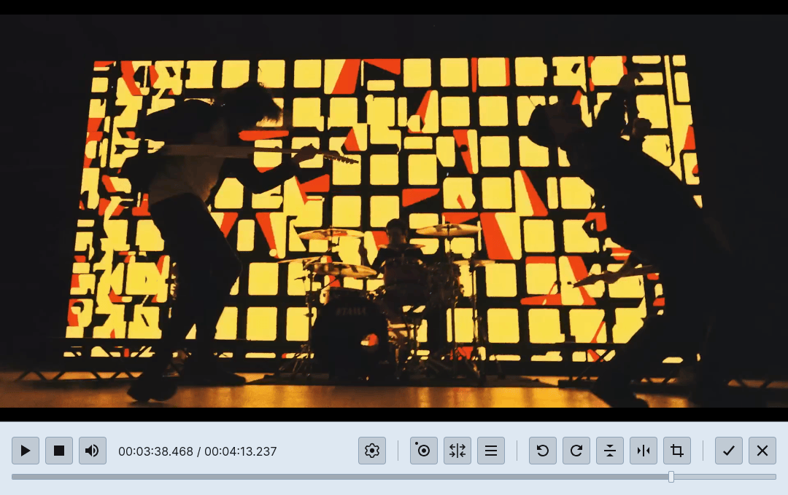

 

  <picture>
    <source media="(prefers-color-scheme: dark)" srcset="assets/images/logo-lite.svg">
    
  </picture>

 

**Viridian** is an **FFmpeg**-based, feature-rich **video editor**, offering a wide variety of both **lossless** and **lossy** operations. It allows you to easily manipulate video files without having to deal with the command line and FFmpeg's complexity, ensuring always the **best output quality possible**.

Viridian is also an excellent tool for advanced users, as it enables you to **manually edit** the final output command as you wish, without holding back any little nuances you might like to control.

# Features

- **Fast**, as it uses native FFmpeg binaries for video processing
- Simple, yet **powerful video player**, with support for thumbnails, various navigation options (frame advance, between clips, keyframes, etc.) and metadata correction (aspect ratio, rotation)
- Lossy visual operations such as **crop**, **rotate**, **flip/mirror** and **scale**
- Open multiple files at once, allowing lossless and lossy **concatenation**
- Several **video cut** modes: lossy, lossless (normal and keyframe) and smart (lossy + lossless)
- Rich cut manipulation: drag, resize, snap, split and manually edit video clips
- Export clips to individual files or merge everything together
- Extensive video format and encoding output settings
- View current encoding status (lossy/lossless/mixed)
- View and modify the final output command
- File tracks and metadata viewer
- Frame capture/screenshot
- Remove audio tracks
- Clear file metadata

# Documentation | How to Use

Visit the [wiki](https://github.com/Hipnosis183/Viridian/wiki) page to have a deeper understanding on how Viridian works, all the available functionality, and how it uses FFmpeg under the hood.

The documentation also goes into some basic and advanced **video processing concepts** in a simple yet explanatory manner, something that's usually not very common to find online, and will help you to understand why some things are the way they are.

# Screenshots

# Acknowledgements

- [FFmpeg](https://ffmpeg.org/), for being the backbone of, not only Viridian, but every single video processing program out there.
- [Gyan Doshi](https://www.gyan.dev/) and [John Van Sickle](https://johnvansickle.com/) for the static FFmpeg binaries.
- [Resizable](https://github.com/dy/resizable), for making the crop tool less of a pain to develop, and allowing the editing flexibility of video clips.
- [LosslessCut](https://github.com/mifi/lossless-cut), for the initial inspiration, and for having some good design aspects I shamelessly borrowed from.